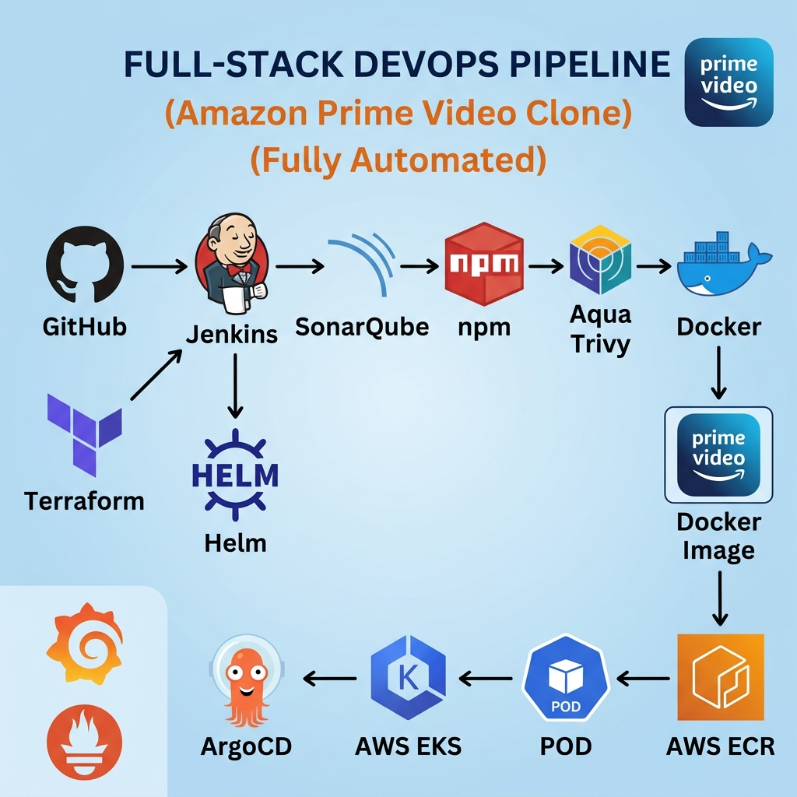

# 🚀 Full-Stack DevOps Pipeline — Amazon Prime Video Clone

> A **fully automated**, production-grade CI/CD pipeline for deploying an Amazon Prime Video clone using modern DevOps practices and cloud-native tooling.

---


---

<div align="center">



</div>

---

## 📋 Table of Contents

- [Project Overview](#-project-overview)
- [Architecture](#-architecture)
- [Tech Stack](#-tech-stack)
- [Pipeline Flow](#-pipeline-flow)
- [Prerequisites](#-prerequisites)
- [Project Structure](#-project-structure)
- [Getting Started](#-getting-started)
  - [1. Clone the Repository](#1-clone-the-repository)
  - [2. Local Development](#2-local-development)
  - [3. Docker Build](#3-docker-build)
  - [4. Infrastructure Provisioning (Terraform)](#4-infrastructure-provisioning-terraform)
  - [5. CI/CD Pipeline (Jenkins)](#5-cicd-pipeline-jenkins)
  - [6. GitOps Deployment (ArgoCD)](#6-gitops-deployment-argocd)
  - [7. Monitoring (Prometheus & Grafana)](#7-monitoring-prometheus--grafana)
- [Pipeline Stages](#-pipeline-stages)
- [Infrastructure as Code](#-infrastructure-as-code)
- [Monitoring & Observability](#-monitoring--observability)
- [Security](#-security)
- [Contributing](#-contributing)
- [License](#-license)

---

## 🎯 Project Overview

This project demonstrates a **complete end-to-end DevOps pipeline** for an Amazon Prime Video clone application. The entire workflow — from code commit to production deployment — is **fully automated** with industry-standard tools.

### What This Project Covers

| Area                         | Tools Used                          |
| ---------------------------- | ----------------------------------- |
| **Source Control**           | GitHub                              |
| **CI/CD Automation**         | Jenkins                             |
| **Code Quality**             | SonarQube                           |
| **Dependency Management**    | npm                                 |
| **Security Scanning**        | Aqua Trivy                          |
| **Containerization**         | Docker                              |
| **Container Registry**       | AWS ECR                             |
| **Infrastructure as Code**   | Terraform                           |
| **Kubernetes Orchestration** | AWS EKS                             |
| **Package Management**       | Helm                                |
| **GitOps / Continuous Delivery** | ArgoCD                          |
| **Monitoring**               | Prometheus & Grafana                |

---

## 🏗 Architecture

```
Developer → GitHub → Jenkins Pipeline
                         │
                         ├── 1. Code Checkout
                         ├── 2. SonarQube Analysis (Code Quality)
                         ├── 3. npm Install & Build
                         ├── 4. Trivy Scan (Security)
                         ├── 5. Docker Build & Tag
                         ├── 6. Push to AWS ECR
                         │
                         ▼
                    AWS ECR (Container Registry)
                         │
                         ▼
                    ArgoCD (GitOps)
                         │
                         ├── Watches Helm chart changes
                         ├── Syncs desired state
                         │
                         ▼
                    AWS EKS Cluster
                         │
                         ├── Pulls image from ECR
                         ├── Deploys Pods via Helm
                         ├── Manages Services & Ingress
                         │
                         ▼
                    Prometheus + Grafana (Monitoring)
```

### High-Level Flow

```
┌──────────┐    ┌──────────┐    ┌────────────┐    ┌───────┐    ┌───────┐    ┌────────┐
│  GitHub  │───▶│ Jenkins  │───▶│ SonarQube  │───▶│  npm  │───▶│ Trivy │───▶│ Docker │
└──────────┘    └──────────┘    └────────────┘    └───────┘    └───────┘    └────┬───┘
                                                                                 │
                     ┌──────────────────────────────────────────────────────────┘
                     ▼
              ┌────────────┐    ┌──────────┐    ┌─────────┐    ┌─────────────┐
              │  AWS ECR   │───▶│  ArgoCD  │───▶│ AWS EKS │───▶│ Prometheus  │
              │  (Registry)│    │ (GitOps) │    │  (K8s)  │    │ + Grafana   │
              └────────────┘    └──────────┘    └─────────┘    └─────────────┘
```

---

## 🛠 Tech Stack

### Application

| Layer        | Technology     | Purpose                               |
| ------------ | -------------- | ------------------------------------- |
| **Frontend** | React.js       | Amazon Prime Video clone UI           |
| **Backend**  | Node.js        | REST API server                       |
| **Styling**  | CSS            | Responsive design & animations        |

### DevOps & Infrastructure

| Category            | Tool           | Purpose                                    |
| ------------------- | -------------- | ------------------------------------------ |
| **Version Control** | GitHub         | Source code management & webhooks           |
| **CI/CD**           | Jenkins        | Pipeline orchestration & automation         |
| **Code Quality**    | SonarQube      | Static code analysis & quality gates        |
| **Security**        | Aqua Trivy     | Container & filesystem vulnerability scan   |
| **Containerization**| Docker         | Application containerization                |
| **Registry**        | AWS ECR        | Private container image registry            |
| **IaC**             | Terraform      | AWS infrastructure provisioning             |
| **Orchestration**   | AWS EKS        | Managed Kubernetes cluster                  |
| **Packaging**       | Helm           | Kubernetes manifest templating & management |
| **GitOps**          | ArgoCD         | Declarative continuous delivery             |
| **Monitoring**      | Prometheus     | Metrics collection & alerting               |
| **Visualization**   | Grafana        | Dashboards & observability                  |

---

## 🔄 Pipeline Flow

### End-to-End CI/CD Pipeline Stages

```
 ┌─────────────────────────────────────────────────────────────────────────────┐
 │                        JENKINS CI/CD PIPELINE                               │
 ├─────────┬───────────┬──────────┬──────────┬───────────┬────────────────────┤
 │  Stage 1│  Stage 2  │ Stage 3  │ Stage 4  │  Stage 5  │     Stage 6        │
 │         │           │          │          │           │                    │
 │  Clone  │ SonarQube │   npm    │  Trivy   │  Docker   │  Push to ECR      │
 │  Repo   │  Analysis │  Build   │  Scan    │  Build    │  + Deploy via     │
 │         │           │          │          │           │    ArgoCD          │
 └─────────┴───────────┴──────────┴──────────┴───────────┴────────────────────┘
```

1. **📥 Clone** — Pull latest code from GitHub
2. **🔍 SonarQube Analysis** — Static code analysis for bugs, vulnerabilities, code smells
3. **📦 npm Install & Build** — Install dependencies and build the application
4. **🛡️ Trivy Security Scan** — Scan filesystem and Docker images for CVEs
5. **🐳 Docker Build & Tag** — Build production Docker image with proper tagging
6. **📤 Push to AWS ECR** — Push image to private container registry
7. **🚀 ArgoCD Sync** — ArgoCD detects Helm chart changes and deploys to EKS

---

## 📝 Prerequisites

Before setting up this pipeline, ensure you have the following:

### Local Development

- [Node.js](https://nodejs.org/) (v18+)
- [npm](https://www.npmjs.com/) (v9+)
- [Docker](https://www.docker.com/) & Docker Compose
- [Git](https://git-scm.com/)

### CI/CD & Infrastructure

- [Jenkins](https://www.jenkins.io/) (LTS)
- [SonarQube](https://www.sonarsource.com/products/sonarqube/) server
- [Terraform](https://www.terraform.io/) (v1.5+)
- [AWS CLI](https://aws.amazon.com/cli/) configured with proper credentials
- [kubectl](https://kubernetes.io/docs/tasks/tools/)
- [Helm](https://helm.sh/) (v3+)
- [ArgoCD CLI](https://argo-cd.readthedocs.io/)
- [Trivy](https://aquasecurity.github.io/trivy/)

### AWS Resources

- AWS Account with IAM permissions for EKS, ECR, VPC, and EC2
- An S3 bucket for Terraform state (recommended)

---

## 📁 Project Structure

```
full_stack_devops_pipeline/
│
├── 📄 server.js                    # Node.js application entry point
├── 📄 package.json                 # Node.js dependencies & scripts
├── 📄 Dockerfile                   # Multi-stage Docker build
├── 📄 docker-compose.yml           # Local development orchestration
├── 📄 Jenkinsfile                  # CI/CD pipeline definition
├── 📄 .dockerignore                # Docker build exclusions
├── 📄 .gitignore                   # Git exclusions
├── 📄 README.md                    # Project documentation (this file)
│
├── 📂 src/                         # Application source code
│   ├── 📂 components/              # React components
│   ├── 📂 pages/                   # Page-level components
│   ├── 📂 assets/                  # Static assets (images, icons)
│   └── 📄 App.js                   # Main React application
│
├── 📂 terraform/                   # Infrastructure as Code
│   ├── 📄 main.tf                  # Main Terraform configuration
│   ├── 📄 variables.tf             # Input variables
│   ├── 📄 outputs.tf               # Output values
│   ├── 📄 provider.tf              # AWS provider configuration
│   ├── 📂 modules/
│   │   ├── 📂 vpc/                 # VPC networking module
│   │   ├── 📂 eks/                 # EKS cluster module
│   │   └── 📂 ecr/                 # ECR repository module
│   └── 📄 terraform.tfvars         # Variable values
│
├── 📂 helm/                        # Helm chart for Kubernetes deployment
│   ├── 📄 Chart.yaml               # Chart metadata
│   ├── 📄 values.yaml              # Default configuration values
│   └── 📂 templates/
│       ├── 📄 deployment.yaml      # K8s Deployment manifest
│       ├── 📄 service.yaml         # K8s Service manifest
│       ├── 📄 ingress.yaml         # K8s Ingress manifest
│       └── 📄 hpa.yaml             # Horizontal Pod Autoscaler
│
├── 📂 monitoring/                  # Monitoring stack configuration
│   ├── 📄 prometheus.yml           # Prometheus configuration
│   └── 📂 grafana/
│       └── 📂 dashboards/          # Grafana dashboard JSON files
│
└── 📂 scripts/                     # Utility scripts
    ├── 📄 setup-jenkins.sh         # Jenkins setup automation
    ├── 📄 install-tools.sh         # Tool installation script
    └── 📄 cleanup.sh               # Resource cleanup script
```

---

## 🚀 Getting Started

### 1. Clone the Repository

```bash
git clone https://github.com/<your-username>/full-stack-devops-pipeline.git
cd full-stack-devops-pipeline
```

### 2. Local Development

```bash
# Install dependencies
npm install

# Start the development server
npm run dev

# Application will be available at http://localhost:3000
```

### 3. Docker Build

```bash
# Build the Docker image
docker build -t prime-video-clone .

# Run the container
docker run -d -p 3000:3000 --name prime-clone prime-video-clone

# Or use Docker Compose
docker-compose up -d
```

### 4. Infrastructure Provisioning (Terraform)

```bash
cd terraform/

# Initialize Terraform
terraform init

# Preview the infrastructure changes
terraform plan

# Apply — provisions VPC, EKS Cluster, ECR, and IAM Roles
terraform apply -auto-approve

# Get EKS kubeconfig
aws eks update-kubeconfig --name prime-clone-cluster --region us-east-1
```

### 5. CI/CD Pipeline (Jenkins)

#### Jenkins Setup

1. **Install Jenkins** on an EC2 instance or run locally via Docker:
   ```bash
   docker run -d --name jenkins \
     --restart=on-failure \
     -p 8080:8080 \
     -v jenkins_home:/var/jenkins_home \
     -v /var/run/docker.sock:/var/run/docker.sock \
     jenkins/jenkins:lts
   ```

2. **Install required Jenkins plugins:**
   - Docker Pipeline
   - SonarQube Scanner
   - AWS Credentials
   - Pipeline: AWS Steps
   - NodeJS Plugin

3. **Configure credentials** in Jenkins:
   - `github-credentials` — GitHub personal access token
   - `sonarqube-token` — SonarQube authentication token
   - `aws-credentials` — AWS Access Key & Secret Key
   - `dockerhub-credentials` — Docker Hub credentials (if using)

4. **Create a Pipeline job** pointing to the `Jenkinsfile` in this repository.

5. **Set up GitHub Webhook** → `http://<jenkins-url>:8080/github-webhook/`

#### Jenkinsfile Overview

```groovy
pipeline {
    agent any

    environment {
        AWS_ACCOUNT_ID   = credentials('aws-account-id')
        AWS_REGION       = 'us-east-1'
        ECR_REPO         = "${AWS_ACCOUNT_ID}.dkr.ecr.${AWS_REGION}.amazonaws.com/prime-clone"
        SONAR_HOST       = 'http://<sonarqube-server>:9000'
    }

    stages {
        stage('Checkout')          { steps { git branch: 'main', url: '...' } }
        stage('SonarQube Analysis'){ steps { /* SonarQube scanner */ } }
        stage('npm Build')         { steps { sh 'npm install && npm run build' } }
        stage('Trivy FS Scan')     { steps { sh 'trivy fs --severity HIGH,CRITICAL .' } }
        stage('Docker Build')      { steps { sh 'docker build -t prime-clone .' } }
        stage('Trivy Image Scan')  { steps { sh 'trivy image prime-clone' } }
        stage('Push to ECR')       { steps { /* ECR login & push */ } }
        stage('Deploy via ArgoCD') { steps { /* Update Helm values, ArgoCD syncs */ } }
    }

    post {
        success { echo '✅ Pipeline completed successfully!' }
        failure { echo '❌ Pipeline failed. Check logs.' }
    }
}
```

### 6. GitOps Deployment (ArgoCD)

```bash
# Install ArgoCD on EKS
kubectl create namespace argocd
kubectl apply -n argocd -f https://raw.githubusercontent.com/argoproj/argo-cd/stable/manifests/install.yaml

# Access ArgoCD UI
kubectl port-forward svc/argocd-server -n argocd 8080:443

# Get initial admin password
kubectl -n argocd get secret argocd-initial-admin-secret -o jsonpath="{.data.password}" | base64 -d

# Create ArgoCD Application (points to Helm chart in this repo)
argocd app create prime-clone \
  --repo https://github.com/<your-username>/full-stack-devops-pipeline.git \
  --path helm/ \
  --dest-server https://kubernetes.default.svc \
  --dest-namespace production \
  --sync-policy automated
```

### 7. Monitoring (Prometheus & Grafana)

```bash
# Install Prometheus & Grafana via Helm
helm repo add prometheus-community https://prometheus-community.github.io/helm-charts
helm repo update

helm install monitoring prometheus-community/kube-prometheus-stack \
  --namespace monitoring \
  --create-namespace

# Access Grafana dashboard
kubectl port-forward svc/monitoring-grafana -n monitoring 3000:80
# Default credentials — admin / prom-operator
```

---

## 🔒 Security

This pipeline implements **security at every stage**:

| Layer                  | Tool/Practice                    | Description                                     |
| ---------------------- | -------------------------------- | ----------------------------------------------- |
| **Code Quality**       | SonarQube                        | Detects bugs, code smells & vulnerabilities      |
| **Dependency Scan**    | Trivy (filesystem mode)          | Scans `node_modules` for known CVEs              |
| **Image Scan**         | Trivy (image mode)               | Scans built Docker image for OS/library vulns    |
| **Registry**           | AWS ECR (private)                | Images stored in private, encrypted registry     |
| **Secrets Management** | Jenkins Credentials Store        | No hardcoded secrets in code                     |
| **Network**            | AWS VPC + Security Groups        | Isolated network with least-privilege access     |
| **Cluster**            | EKS with RBAC                    | Role-based access control for Kubernetes         |

---

## 📊 Monitoring & Observability

| Component      | Purpose                                    | Access                              |
| -------------- | ------------------------------------------ | ----------------------------------- |
| **Prometheus** | Metrics collection, alerting rules         | `http://<cluster-ip>:9090`          |
| **Grafana**    | Visualization dashboards                   | `http://<cluster-ip>:3000`          |
| **ArgoCD UI**  | Deployment status & sync health            | `http://<cluster-ip>:8080`          |
| **Jenkins**    | Pipeline logs & build history              | `http://<jenkins-ip>:8080`          |

### Key Metrics Monitored

- 🟢 **Application** — Request latency, error rates, throughput
- 🔵 **Kubernetes** — Pod health, resource utilization, node status
- 🟠 **Infrastructure** — CPU, memory, disk, network I/O
- 🔴 **Alerts** — Pipeline failures, pod crashes, high error rates

---

## 🤝 Contributing

Contributions are welcome! Please follow these steps:

1. **Fork** the repository
2. **Create** a feature branch: `git checkout -b feature/amazing-feature`
3. **Commit** your changes: `git commit -m 'Add amazing feature'`
4. **Push** to the branch: `git push origin feature/amazing-feature`
5. **Open** a Pull Request

### Commit Convention

```
feat: add new feature
fix: bug fix
docs: documentation update
ci: CI/CD pipeline changes
infra: infrastructure changes
refactor: code refactoring
test: add or update tests
```

---

## 📄 License

This project is licensed under the **MIT License** — see the [LICENSE](LICENSE) file for details.

---

## 🙏 Acknowledgments

- [Amazon Prime Video](https://www.primevideo.com/) — UI inspiration
- [Jenkins](https://www.jenkins.io/) — CI/CD automation
- [Terraform](https://www.terraform.io/) — Infrastructure as Code
- [ArgoCD](https://argo-cd.readthedocs.io/) — GitOps continuous delivery
- [Kubernetes](https://kubernetes.io/) — Container orchestration
- [Prometheus](https://prometheus.io/) & [Grafana](https://grafana.com/) — Monitoring stack

---

<div align="center">

**⭐ Star this repo if you find it helpful!**

Built with ❤️ using modern DevOps practices

</div>
